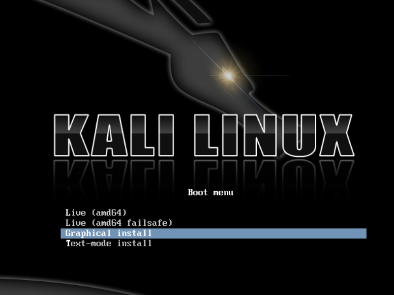
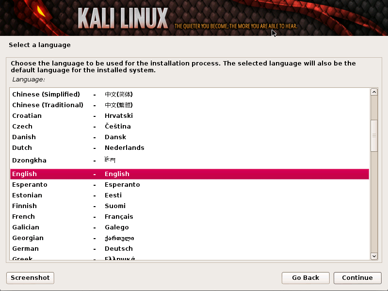
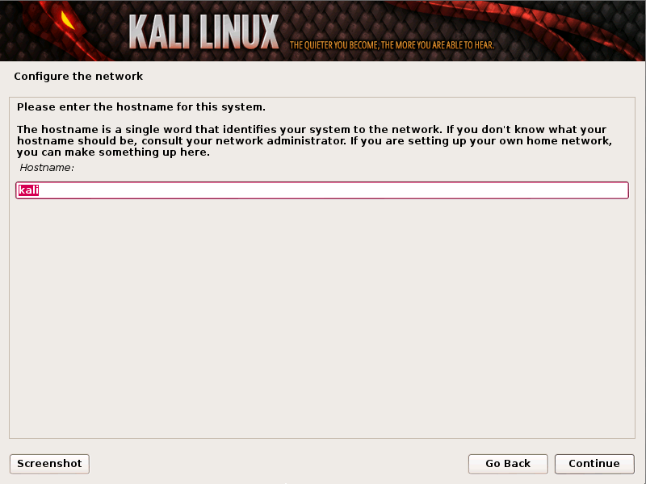
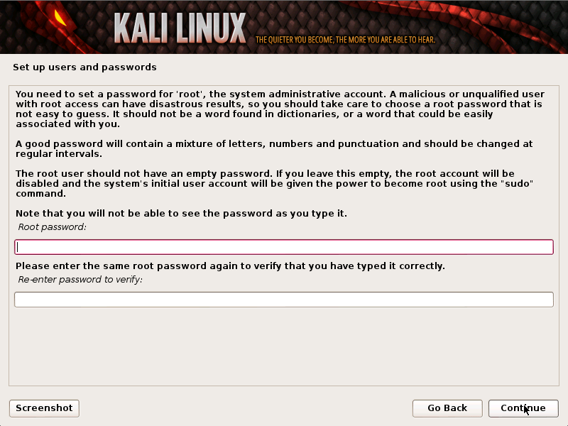
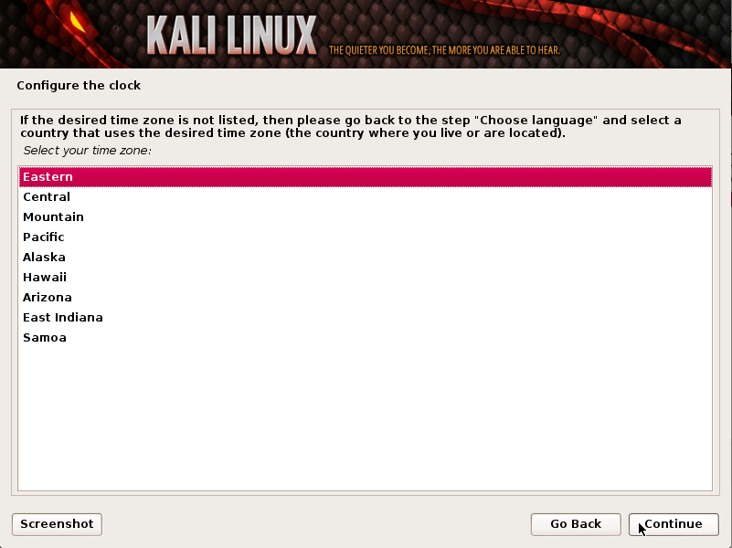
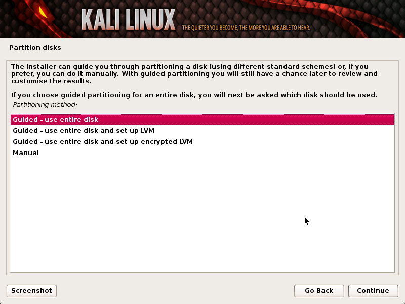
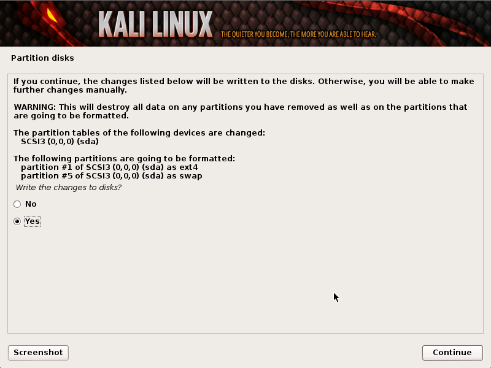
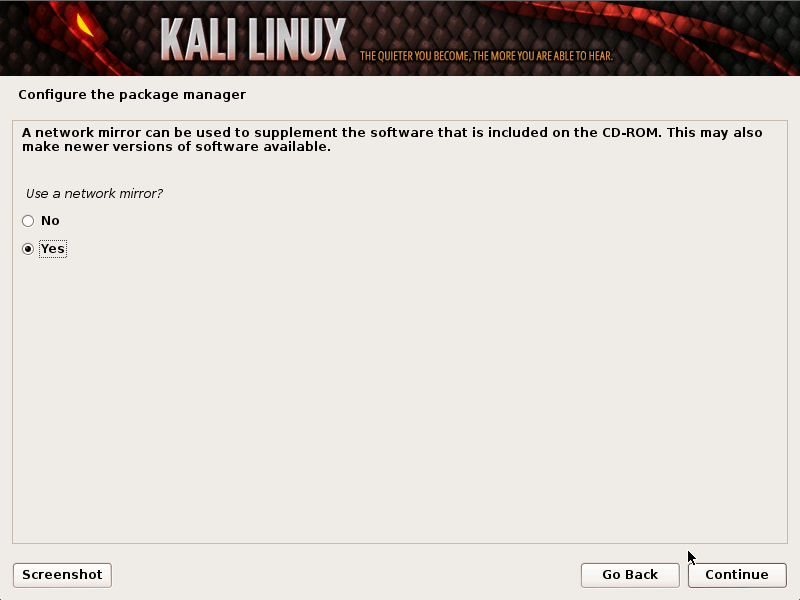
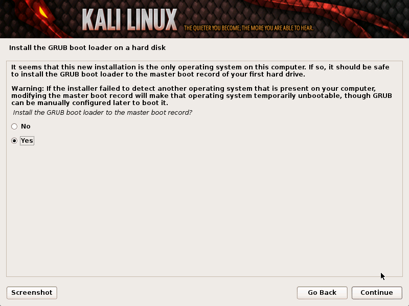
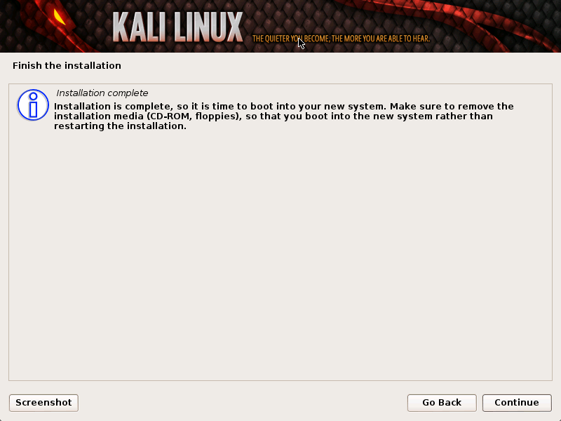

## Introduction

Installing Kali Linux on your computer is an easy process. First, you’ll need compatible computer hardware. 

Kali is supported on i386, amd64, and ARM (both armel and armhf) platforms. 
The hardware requirements are minimal as listed below, although better hardware will naturally provide better performance. 
The i386 images have a default PAE kernel, so you can run them on systems with over 4GB of RAM. Download Kali Linux and either burn the ISO to DVD, or prepare a USB stick with Kali Linux Live as the installation medium. 
If you do not have a DVD drive or USB port on your computer, check out the Kali Linux Network Install.

## Installation Prerequisites
1. A minimum of 10 GB disk space for the Kali Linux install.
2. For i386 and amd64 architectures, a minimum of 512MB RAM.
3. CD-DVD Drive / USB boot support

## Preparing for the Installation
1. Download Kali linux.
2. Burn The Kali Linux ISO to DVD or Image Kali Linux Live to USB.
3. Ensure that your computer is set to boot from CD / USB in your BIOS.

## Kali Linux Installation Procedure

1. To start your installation, boot with your chosen installation medium. You should be greeted with the Kali Boot screen. Choose either Graphical or Text-Mode install. In this example, we chose a GUI install.

2. Select your preferred language and then your country location. You’ll also be prompted to configure your keyboard with the appropriate keymap.

3. The installer will copy the image to your hard disk, probe your network interfaces, and then prompt you to enter a hostname for your system. In the example below, we’ve entered “kali” as our hostname.

4. Enter a robust password for the root account.

5. Next, set your time zone.

6. The installer will now probe your disks and offer you four choices. In our example, we’re using the entire disk on our computer and not configuring **LVM** (logical volume manager). Experienced users can use the “Manual” partitioning method for more granular configuration options.

7. Next, you’ll have one last chance to review your disk configuration before the installer makes irreversible changes. After you click Continue, the installer will go to work and you’ll have an almost finished installation.

8. Configure network mirrors. Kali uses a central repository to distribute applications. You’ll need to enter any appropriate proxy information as needed.

NOTE! If you select “NO” in this screen, you will NOT be able to install packages from Kali repositories.

9. Next, install GRUB.

10. Finally, click Continue to reboot into your new Kali installation.

## Conclusion 
Kali Linux has many use and most useful for linux ethical hackers . Now that we have installed kali linux on a clean hard drive . Have a look at the [Kali linux doc](https://www.kali.org/docs/)
 to understand more.
