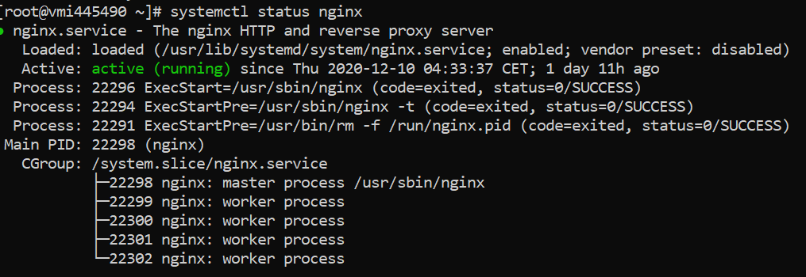
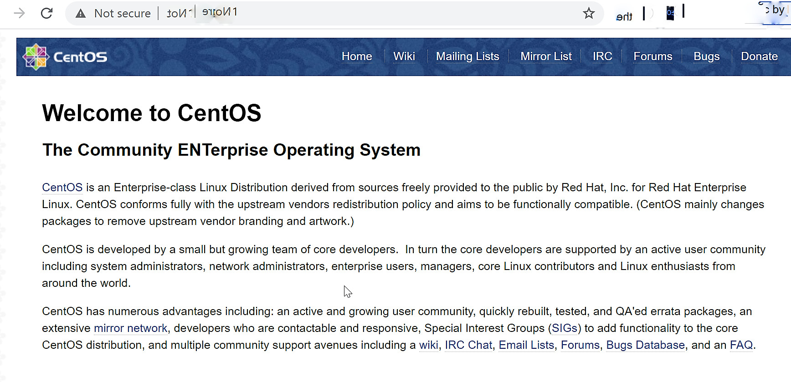

## Introduction

What is Nginx ?
In case you haven't heard about Nginx , think it as a Load Balancer initially , but i tell you it is more than that .
Nginx is a high perforant load balancer and reverse proxy , it can handle much more no of http concurrent requests than Apache .

Nginx can also act as a standalone web server and it is one of the most commonly used multipurpose tool loved by system adfmins .It is extremely popular in handling high traffic due to its event loop architecture . Nginx can handle 10,000 concurrent requests .

In this article we will learn  how to install  Nginx on your CentOS 7 server or machine.


##Pre-Requisistes
A **CentOS/RHEL 7**  production server or a Linux VPS . Make sure you do not have **Port 80** & **PORT 8443** occupied .

## Setup Nginx Repository in Centos 7
In order to setup nginx repository we need to add **Centos7 EPEL** repository.
```bash
sudo yum install epel-release
```
you can also setup in a different way below manually.

## Setup Nginx Repo Manually On Centos7/RHEL

In order to setup manually you can login with root user or any user with which you want your nginx to run .
Create a file ```nginx.repo``` in following directory .

```bash
$ vi /etc/yum.repos.d/nginx.repo
```
lets add the centos 7 repository below , if you have Centos7 Server.

```bash
[nginx]
name=nginx repo
baseurl=https://nginx.org/packages/centos/7/$basearch/
gpgcheck=0
enabled=1
```
Let's add RHEL 7 repository if you have RHEL version .

```bash
[nginx]
name=nginx repo
baseurl=https://nginx.org/packages/rhel/7/$basearch/
gpgcheck=0
enabled=1
```

## Installing Nginx On Centos7
Once we have the repository added we can now install nginx using below command
```bash
sudo yum install nginx
```
Nginx will now get installed on your VPS or Server. Next step is verify installation.
## Verify Nginx Installation 
Now we have installed nginx , next step is to verify if the installation actually works .Let's follow the steps below.
```shell
sudo systemctl enable nginx
sudo systemctl start nginx
```
Above command will register nginx as a systemd service and now we can actually check the status of our service.
```bash
sudo systemctl status nginx
```
OutPut :


If you dont find the status as green , you might be having trouble installing due to permission or one of the Port 80 or 8443 is occupied already . Verify that an d reinstall.

Now , try to acess nginx using your IP you should have seen the default nginx home page . If you are not able to get the default page using your IP then we need to configure firewall .

## Configure FireWalld Allow Nginx Access
Now we need to configure firewalld in order to enable nginx acess from outside network .
Execute the following commands
```bash
sudo firewall-cmd --zone=public --permanent --add-service=http
sudo firewall-cmd --zone=public --permanent --add-service=https
sudo firewall-cmd --reload
```
Now once you have provide nginx firewall access , you should be able to access the default home page of nginx using **YOUR_IP**.

```shell
http://YOUR_IP
```



> You Will Feel Linux If You Use It Via Console.

## Must Know Nginx Configurations
1. All Configurations are stored in ```/etc/nginx/``` directory and  default conf file is ```etc/nginx/nginx.conf```
2. ```nginx -t``` is used to test the configuration changes
3. In case of any unknown error always try to first check the nginx logs under ```/var/log/nginx``` directory . It has two different log files ```access.log``` and ```error.log``` which has info about nginx errors and general info.

## Conclusion
Nginx is One of the best reverse proxy and load balancer tool available in the market . But any tool you use has few limitations too . 
Try using it based on your requirement . 

Happy Coding ... 