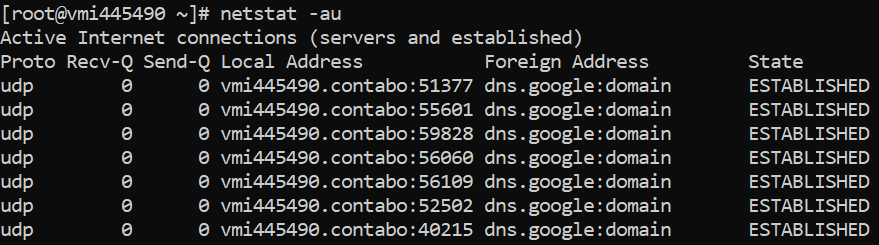
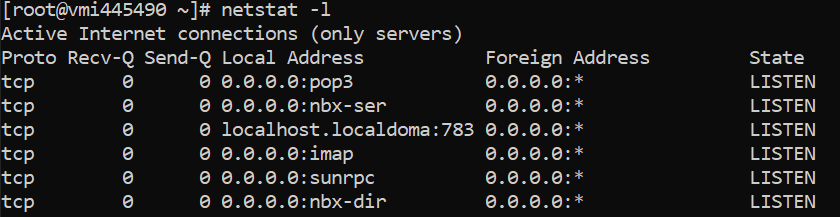
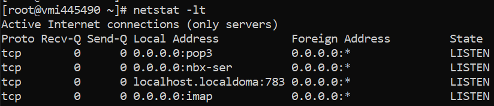
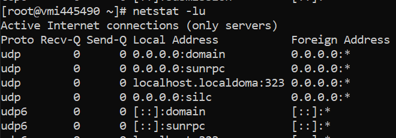
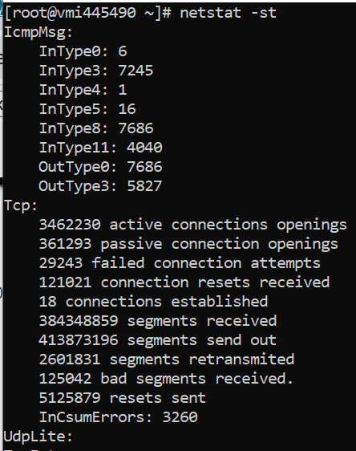

## Introduction
Netstat is one of the most used command for checking and monitoring network configurations , iptables and routing informations.
 Let's take out the 10 most practical examples used commonly in day to day system admin job.

##Pre-Requisistes
A **CentOS/RHEL 7**  production server or a Linux VPS with **netstat** utility installed working on your server.

## List All Connections With Ports 
If you want to list down all the listening and non listening ports , you can do as shown below
```bash
netstat -a | more
```
output :-
```bash
Active Internet connections (servers and established)
Proto Recv-Q Send-Q Local Address           Foreign Address         State
tcp        0      0 0.0.0.0:pop3            0.0.0.0:*               LISTEN
tcp        0      0 localhost.localdoma:783 0.0.0.0:*               LISTEN
tcp        0      0 0.0.0.0:imap            0.0.0.0:*               LISTEN
tcp        0      0 0.0.0.0:sunrpc          0.0.0.0:*               LISTEN
tcp        0      0 0.0.0.0:http            0.0.0.0:*               LISTEN
tcp        0      0 0.0.0.0:urd             0.0.0.0:*               LISTEN
tcp        0      0 0.0.0.0:domain          0.0.0.0:*               LISTEN
Active UNIX domain sockets (servers and established)
Proto RefCnt Flags       Type       State         I-Node   Path
unix  3      [ ]         DGRAM                    9477     /run/systemd/notify
unix  2      [ ]         DGRAM                    15622    /var/run/chrony/chronyd.sock
unix  2      [ ]         DGRAM                    9479     /run/systemd/cgroups-agent
```
Once you press enter it shows more items in the list .

##### Find All TCP Ports 
In above example we have listen down all the ports but lets say i only need to find TCP ports used in my server. Lets see how we can do that .
```bash
netstat -at
```
output :- 
```bash
Active Internet connections (servers and established)
Proto Recv-Q Send-Q Local Address           Foreign Address         State
tcp        0      0 0.0.0.0:pop3            0.0.0.0:*               LISTEN
tcp        0      0 localhost.localdoma:783 0.0.0.0:*               LISTEN
tcp        0      0 0.0.0.0:imap            0.0.0.0:*               LISTEN
tcp        0      0 0.0.0.0:sunrpc          0.0.0.0:*               LISTEN
```
##### Find All UDP Ports 
If we want to list down all UDP ports opened and listened in my server we can run the below command
```bash
netstat -au
```
Output :-


## List All Sockets With LISTEN state in Server
If you are only concerned with all ports and wan to know all listen ports use ```-l``` option . 
Along with this if you want to list down all TCP ports which are in LISTEN state use ```-lt``` . For getting UDP  Ports which are in LISTEN state use ```-lu``` .
```bash
netstat -l
```
Output:-


##### Find all TCP Ports In LISTEN State
```bash
netstat -lt
```
Output:-


##### Find All UDP Ports In LISTEN state
```bash
netstat -lu
```
Output:-


## Show the statistics TCP, UDP protocol
```bash
netstat -s
```
Output:-


In Order to retrieve statistics of all TCP ports we can get that using below command .
```bash
netstat -st
```



